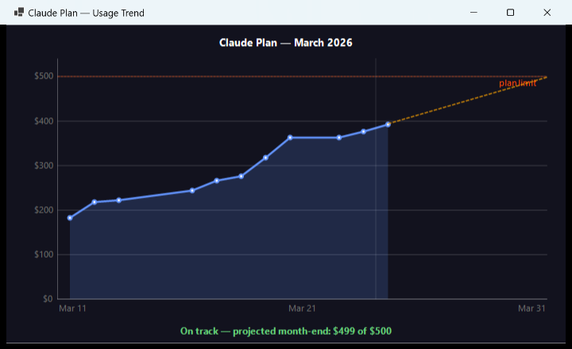

# ClaudeCap

**ClaudeCap** is a Windows system tray application that tracks your [Claude.ai](https://claude.ai) plan usage in real time — so you always know how much of your monthly budget you've spent, right from the taskbar.

---



## Features

- **Live tray icon** — color-coded by usage level (normal → orange at 90% → dark red at 100%)
- **Smart notifications** — one-time balloon alerts at 80%, 90%, and 100% thresholds
- **Usage trend graph** — GDI+ chart with actual spend curve, linear regression projection to month-end, and plan limit line
- **Granular history** — up to 4 readings per day (every 6 hours), stored for 62 days
- **Claude Code status line** — self-installs a status line script on first run, showing `💰 ██░░ $12/$100` directly in your Claude Code terminal
- **SSO-safe authentication** — uses an embedded WebView2 (Edge/Chromium) browser; works with Okta, Google SSO, and any enterprise login
- **Configurable refresh interval** — right-click the tray icon to set 1, 5, 15, or 30 minutes
- **Zero setup** — self-installs on first run; ships as a single `.exe`

---

## Requirements

| Variant | Requirement |
|---------|------------|
| **Standalone** (`publish-standalone/ClaudeCap.exe`) | Windows 10/11, Edge/WebView2 (ships with Windows 11) |
| **Slim** (`publish-slim/ClaudeCap.exe`) | Windows 10/11 + [.NET 9 Desktop Runtime](https://dotnet.microsoft.com/download/dotnet/9.0) |

> **WebView2** is bundled with Windows 11 and Microsoft Edge. If you're on Windows 10 without Edge installed, use the standalone build or install the [WebView2 Runtime](https://developer.microsoft.com/microsoft-edge/webview2/).

---

## How to Install

### Option A — Standalone (recommended, no dependencies)

1. Download `ClaudeCap.exe` from the [Releases](../../releases) page (standalone build, ~109 MB).
2. Place it anywhere — e.g. `C:\Tools\ClaudeCap\ClaudeCap.exe`.
3. Double-click to run.

On first launch, ClaudeCap automatically:
- Writes `~/.claude/statusline-command.sh` (the Claude Code status line script)
- Patches `~/.claude/settings.json` to register the status line command

### Option B — Slim (if you already have .NET 9 Desktop Runtime)

1. Download `ClaudeCap.exe` from the slim build (~1.1 MB).
2. Ensure [.NET 9 Desktop Runtime](https://dotnet.microsoft.com/download/dotnet/9.0) is installed.
3. Run `ClaudeCap.exe`.

### Option C — Add to Windows startup

To have ClaudeCap start automatically with Windows:

1. Press `Win + R`, type `shell:startup`, press Enter.
2. Create a shortcut to `ClaudeCap.exe` in that folder.

---

## Usage

After launching, ClaudeCap appears in your **system tray** (bottom-right of the taskbar, click the `^` arrow if hidden).

**Tray icon colors:**

| Color | Meaning |
|-------|---------|
| Normal (cap icon) | Usage below 90% |
| Orange | Usage ≥ 90% |
| Dark red | Usage ≥ 100% (plan exhausted) |
| Red | Fetch error |

**Right-click the tray icon** for the context menu:

- **Usage display** — shows current spend (`$12.50 / $100.00 · 12%`)
- **View usage trend…** — opens the trend graph
- **Refresh every** — set the polling interval (1 / 5 / 15 / 30 minutes)
- **Refresh now** — force an immediate fetch
- **Exit**

### Usage Trend Graph

The graph shows:
- **Blue curve** — actual spend over time (up to 4 data points per day for intraday detail)
- **Filled area** — spend volume at a glance
- **Dashed orange line** — linear regression projection to end of month
- **Dashed red line** — your plan limit
- **Dots** — one per day (last reading of the day) to keep the chart clean
- **Summary label** — "On track — projected month-end: $X" or "⚠ Trend: plan depletes around Mar 25"

---

## Claude Code Status Line Integration

On first run, ClaudeCap installs a shell script at `~/.claude/statusline-command.sh` and registers it in `~/.claude/settings.json`. This adds a plan budget bar to your Claude Code terminal status line:

```
💰 ██████░░░░ $12/$100
```

The status line reads from `~/.claude/usage_data.json`, which ClaudeCap updates on every successful fetch.

---

## Files Written

| Path | Contents |
|------|----------|
| `~/.claude/usage_data.json` | Latest fetch: `percent`, `used_dollars`, `total_dollars`, `reset` |
| `~/.claude/usage_history.json` | Up to 250 timestamped readings (~62 days × 4/day) |
| `~/.claude/statusline-command.sh` | Claude Code status line script (auto-installed) |
| `~/.claude/tools/claudecap/config.json` | App config (`RefreshIntervalMinutes`) |

---

## Building from Source

**Prerequisites:** .NET 9 SDK

```bash
git clone https://github.com/zrcds/claude-cap
cd claudecap

# Standalone (~109 MB, no runtime needed)
dotnet publish ClaudeUsageTray.csproj -c Release -r win-x64 -p:SelfContained=true --output bin/publish-standalone

# Slim (~1.1 MB, requires .NET 9 Desktop Runtime)
dotnet publish ClaudeUsageTray.csproj -c Release -r win-x64 -p:SelfContained=false --output bin/publish-slim
```

---

## License

MIT
